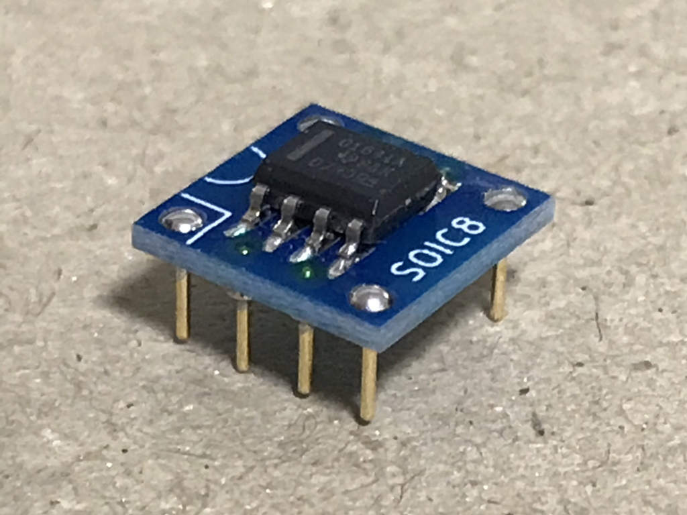

# SOIC2DIP8

SOIC8パッケージのICをDIP8ソケットに乗せるための変換基板のデザインです。
PCB設計には[KiCad](https://www.kicad.org/) 6.0を利用しています。

**狙い**
* ICパッケージの向きを回転させないため、パターンの引き回しを最短に抑えます。
* 基板から直接ピンを生やすことで、実装高さを通常のDIPパッケージと同程度に抑えます。
